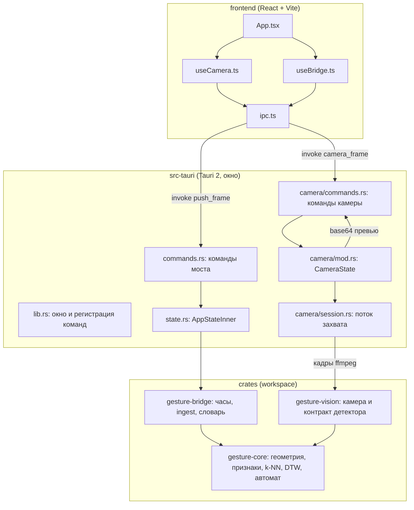
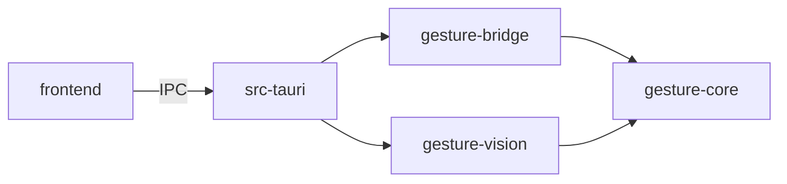
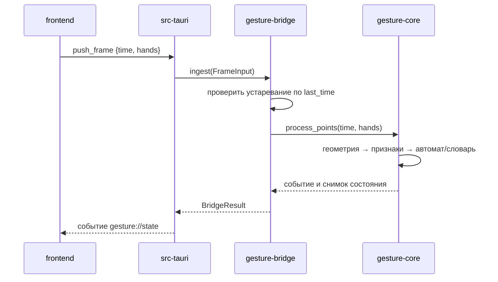
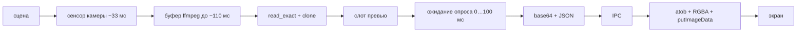
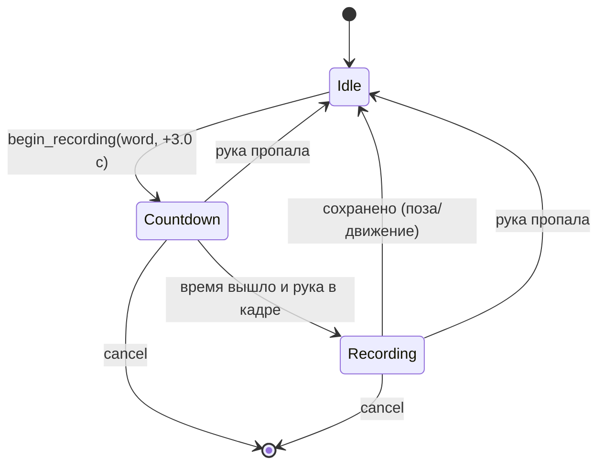
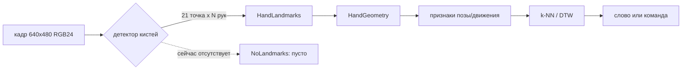
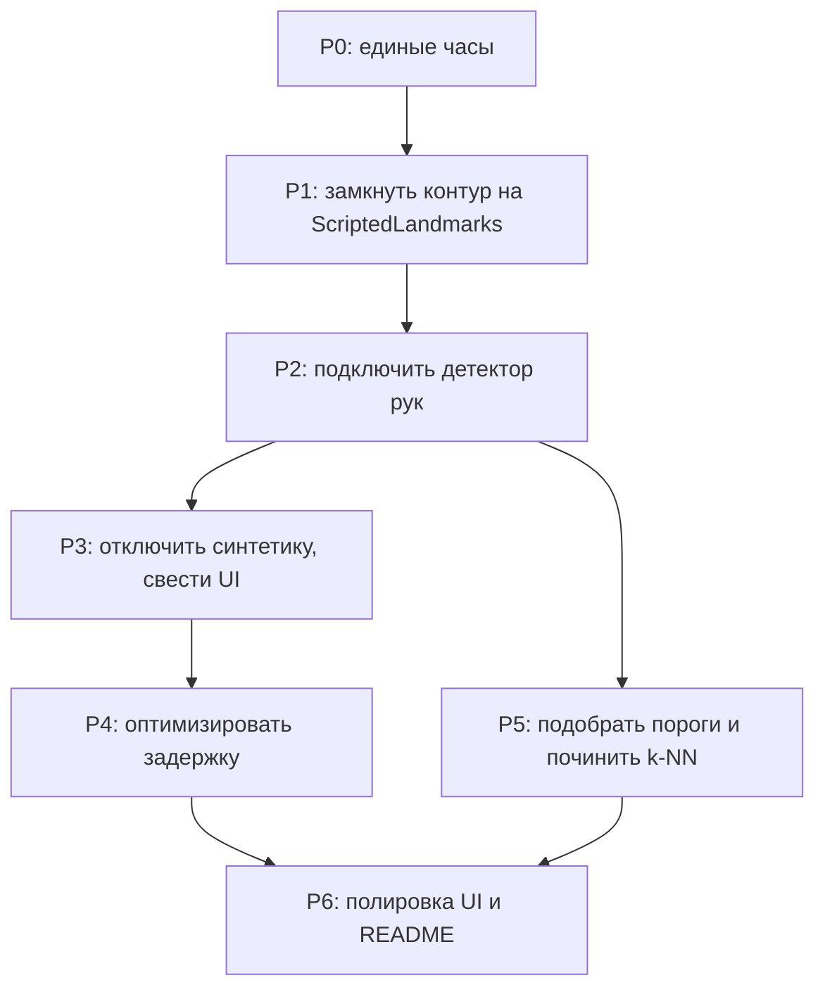

# Полный аудит проекта gesture-control-rs

Дата: 2026-09-29
Репозиторий: `/home/redalexdad/GitHub/gesture-control-rs`
Ветка: `master`, коммит на момент аудита: `0497774`
Контекст: ручной прогон `make dev` с камерой `/dev/video0`,
разрешение захвата 640x480, частота 30 fps, превью 640x480,
Tauri 2.12, WebKitGTK 4.1, glibc 2.43.

Связанные документы:

- `reports/exploitation-problems.md` — разбор четырёх эксплуатационных
  проблем предыдущего этапа (счётчик fps, падение WebKit, логи, `cargo fmt`).
- Настоящий документ — повторный полный аудит: архитектура, поток данных,
  бутылочные горла, слабые места по слоям, разбор трёх заявленных проблем
  (задержка видео, «вторая камера», запись жеста), сверка с референсным
  iOS-проектом `Fen1x678/sign_language_interpretation_on_camera` и план
  внедрения настоящего распознавания жестов.

---

## Оглавление

1. Резюме для владельца
2. Методика аудита
3. Три заявленные проблемы: короткий ответ
4. Архитектура проекта
5. Карта репозитория
6. Поток данных: от пикселя до слова
7. Бюджет задержки: где теряется время
8. Бутылочные горла (подробно)
9. Аудит по слоям
10. Разбор проблемы 1: задержка видео
11. Разбор проблемы 2: «вторая камера» снизу
12. Разбор проблемы 3: запись жеста не работает
13. Сверка с референсным проектом
14. Чего не хватает для распознавания жестов
15. План внедрения детектора рук
16. Полный список слабых мест и рисков
17. Тесты: что покрыто и что нет
18. Сборка, конфигурация, документация
19. План работ по этапам
20. Приложения: контракты, пороги, глоссарий

---

## 1. Резюме для владельца

Проект разделён на четыре слоя и математически аккуратно повторяет
iOS-референс: геометрия кисти, признаки позы, признаки движения, k-NN и
DTW, конечный автомат жестов, словарь и сохранение. Эта часть перенесена
и покрыта тестами.

Однако **сквозного распознавания жестов в приложении сейчас нет**, и это
не мелкая недоделка, а отсутствующее звено:

1. **Нет детектора рук.** Камера складывает пиксели в превью, но никто
   не превращает кадр в 21 точку кисти. Контракт `LandmarkSource`
   объявлен в `crates/gesture-vision/src/lib.rs:159`, но его реализация
   `NoLandmarks` (`:176`) возвращает пустой список и нигде в приложении
   не подключена. Поиск по репозиторию не находит использования
   `LandmarkSource`, `NoLandmarks` или `HandLandmarks` вне самого крейта
   `gesture-vision`. Каталог `models/` в корне пуст.
2. **Запись жеста не может работать** по двум причинам сразу: нет
   источника кадров (следствие пункта 1) и есть рассинхронизация часов
   между интерфейсом и движком, из-за которой любой отправленный кадр
   помечается устаревшим.
3. **Задержка видео** складывается из опроса превью раз в 100 мс,
   кодирования 921 600 байт в base64 на каждый опрос, сериализации в
   JSON и обратного декодирования в окне. Это добавляет к картинке
   от 100 мс и больше, независимо от частоты камеры.
4. **«Вторая камера» снизу** — это не камера, а SVG-заглушка скелета
   `Hands` в `frontend/src/App.tsx:34`, стилизованная так же, как
   настоящий canvas, и потому выглядящая как второй видеоблок.

Дополнительно аудит нашёл набор проблем поменьше: неверный порог
неоднозначности в k-NN, расхождение порогов с референсом, отсутствие
верхней границы размеров в конфиге, `src-tauri` вне рабочего пространства
и потому вне `make test`/`make clippy`/`make fmt`, сломанные
подкоманды `make`, пустой README и другие. Полный список — в разделе 16.

Хорошая новость: архитектура рассчитана именно на добавление детектора
позже (об этом прямо написано в шапке `crates/gesture-vision/src/lib.rs`
и `src-tauri/src/lib.rs:7`), а математика уже готова. Основная работа —
подключить детектор и замкнуть контур «камера → точки → `push_frame`»,
а не переписывать ядро.

---

## 2. Методика аудита

Аудит выполнялся в четыре параллельных прохода по слоям, каждый —
чтением исходников целиком, без запуска изменяющего код:

- слой Tauri-приложения: `src-tauri/src/**`, конфиг, окно, команды;
- слой зрения и ядро распознавания: `crates/gesture-vision`,
  `crates/gesture-core`, `crates/gesture-bridge`;
- фронтенд: `frontend/src/**`;
- сборка, конфигурация, тесты, документация: `Makefile`, `mk/*`,
  `Cargo.toml`, `.env`, README, отчёты.

Дополнительно:

- изучен референсный проект `Fen1x678/sign_language_interpretation_on_camera`
  (iOS, Swift) — README и ключевые файлы `GestureRecognizer.swift`,
  `SignLibrary.swift`, `CameraManager.swift`;
- выполнен поиск по репозиторию на предмет детектора, моделей и
  использования контракта `LandmarkSource`;
- зафиксированы фактические числа (размеры кадров, длины base64,
  интервалы опроса) и сверены с кодом.

Все утверждения ниже снабжены ссылками `file:line`. Значения, полученные
оценкой (а не измерением), помечены как оценка.

---

## 3. Три заявленные проблемы: короткий ответ

| Проблема | Короткий ответ |
|---|---|
| Задержка видео при 30 fps | Превью опрашивается раз в 100 мс, а каждый ответ несёт 921 600 байт base64 (~1,2 МБ JSON). Отсюда минимум ~100 мс искусственной задержки плюс время кодирования/декодирования. Камера при этом честно отдаёт 30 fps. |
| Вторая камера снизу | Это не камера. Это SVG `Hands` (скелет по кнопкам) в `frontend/src/App.tsx:34,183`, оформленный идентично canvas камеры (`styles.css:85`, `:98`). Пустой, пока не нажаты демо-кнопки. |
| Записать жест никак | Интерфейс и движок используют разные часы. `start_recording` ставит отсчёт по монотонным часам приложения (`library.rs:13`), а кадры приходят со счётчиком JS, начинающимся с нуля (`useBridge.ts:44,102`). После этого все кадры отбрасываются как устаревшие. Плюс кадры вообще не идут с камеры — только по кнопкам, 12 штук за нажатие, чего не хватает на отсчёт 3 с и запись 1,5 с. |

---

## 4. Архитектура проекта

Проект — рабочие пространство Rust из трёх крейтов плюс отдельное
Tauri-приложение, которое в это пространство не входит.

Смысл разделения:

- `gesture-core` — чистая математика без ввода-вывода: геометрия кисти,
  признаки, DTW, k-NN, конечный автомат, словарь. Тестируется без камеры.
- `gesture-bridge` — часы, приём кадров, команды управления движком,
  библиотека жестов и её сохранение на диск.
- `gesture-vision` — камера и (по замыслу) детектор кистей: контракт
  `LandmarkSource`, приведение точек к геометрии ядра. Именно здесь
  должно появиться настоящее распознавание рук.
- `src-tauri` — тонкий слой окна: перевод аргументов Tauri в вызовы моста,
  мьютексы, рассылка событий интерфейсу.

### 4.1. Границы и зависимости

Зависимости направлены вниз, циклов нет. `gesture-core` не знает ни о
камере, ни о Tauri, ни о файлах. Это правильная развязка, и она —
главный актив проекта.

### 4.2. Точки входа

- `src-tauri/src/main.rs:6` — вызов `gesture_control_lib::run()`.
- `src-tauri/src/lib.rs:37` — `run()`: лог, `Settings::global()`,
  `AppStateInner::new(GestureBridge::with_file(...))`, `CameraState::new()`,
  сборка окна кодом (`build_window`), регистрация 20 команд.
- `frontend/src/main.tsx` — точка входа React.

---

## 5. Карта репозитория

| Путь | Назначение |
|---|---|
| `Cargo.toml` | Корневое рабочее пространство: `gesture-bridge`, `gesture-core`, `gesture-vision`. `src-tauri` исключён. |
| `crates/gesture-core/src/geometry.rs` | `Point`, `HandGeometry`, `dist`, проверка ладони. |
| `crates/gesture-core/src/joint.rs` | Индексы 21 точки (`WRIST`, `THUMB_CMC`, …, `LITTLE_TIP`). |
| `crates/gesture-core/src/features.rs` | `HandFeatures`: вектор позы 40/82 числа, расстояние. |
| `crates/gesture-core/src/motion.rs` | `MotionFeatures`: кадр движения, `prepare_template`, subsequence DTW. |
| `crates/gesture-core/src/recognizer/machine.rs` | Конечный автомат: появление, дрожание, свайп, удержание. |
| `crates/gesture-core/src/library/classify.rs` | `classify_pose` (k-NN), `classify_motion` (DTW). |
| `crates/gesture-core/src/library/sign.rs` | `CustomSign`: примеры поз и последовательности. |
| `crates/gesture-core/src/library/store.rs` | Сохранение словаря в JSON. |
| `crates/gesture-core/src/pipeline/engine/` | Движок: время, очередь слов, запись, команды. |
| `crates/gesture-core/src/pipeline/constants.rs` | Пороги движка (запись, стрим, команды). |
| `crates/gesture-bridge/src/clock.rs` | `MonotonicClock`, `ManualClock`, `FrameClock`. |
| `crates/gesture-bridge/src/bridge/ingest.rs` | Приём кадра, проверка устаревания, вызов движка. |
| `crates/gesture-bridge/src/bridge/library.rs` | `start_recording`, запись, удаление, сохранение. |
| `crates/gesture-bridge/src/state.rs` | `FrameInput`, `AppState`, `Metrics`. |
| `crates/gesture-vision/src/lib.rs` | `HandLandmarks`, `LandmarkSource`, `NoLandmarks`, `ScriptedLandmarks`. |
| `crates/gesture-vision/src/camera/source.rs` | `FfmpegCamera`: запуск ffmpeg, `next_frame`. |
| `crates/gesture-vision/src/camera/frame.rs` | `RgbFrame`, `resized`, `to_base64`. |
| `crates/gesture-vision/src/camera/config.rs` | `CameraConfig`, сборка команды ffmpeg. |
| `src-tauri/src/lib.rs` | Окно, регистрация команд, лог. |
| `src-tauri/src/commands.rs` | Команды моста и `log_client_error`. |
| `src-tauri/src/camera/mod.rs` | `CameraState`, `start`/`stop`/`preview`/`status`. |
| `src-tauri/src/camera/session.rs` | Поток захвата и слот превью. |
| `src-tauri/src/state.rs` | `AppStateInner`, `failure`, события. |
| `src-tauri/src/config/` | Настройки: умолчания, `.env`, окружение. |
| `frontend/src/App.tsx` | Экран: кадр, состояние, словарь, демо-кнопки. |
| `frontend/src/useCamera.ts` | Опрос и отрисовка превью. |
| `frontend/src/useBridge.ts` | Состояние моста и `pushFrames`. |
| `frontend/src/ipc.ts` | Обёртки команд Tauri. |
| `frontend/src/types.ts` | Типы контракта. |
| `frontend/src/demoFrames.ts` | Синтетические позы для кнопок. |
| `models/` | Пустой каталог: зарезервирован под модель детектора. |
| `reports/` | Отчёты, включая этот. |

---

## 6. Поток данных: от пикселя до слова

### 6.1. Два независимых контура кадров

В приложении сейчас существуют два независимых контура, и они не
соединены:

```mermaid
graph TB
    subgraph REAL["Контур A: настоящая камера"]
        F1["ffmpeg /dev/video0"] --> F2["read_exact 921600 байт"]
        F2 --> F3["RgbFrame"]
        F3 --> F4["слот preview.frame"]
        F4 --> F5["camera_frame → base64"]
        F5 --> F6["canvas в окне"]
    end

    subgraph SYNTH["Контур B: синтетические позы"]
        S1["демо-кнопки App.tsx"] --> S2["demoFrames 21 точка"]
        S2 --> S3["push_frame"]
        S3 --> S4["bridge.ingest"]
        S4 --> S5["engine.process_points"]
        S5 --> S6["skeleton/SVG и слова"]
    end
```

Контур A рисует картинку, но не порождает точек. Контур B порождает
точки, но только по нажатию кнопки и не связан с настоящим кадром.
Именно поэтому распознавание «не работает»: между ними нет моста.

### 6.2. Контракт точек

`FrameInput` (`crates/gesture-bridge/src/state.rs:15`) содержит `time` и
`hands: Vec<Vec<PointSer>>`. Каждая рука — ровно 21 точка; иначе `ingest`
отклонит кисть (`ingest.rs:42`). Точки — пиксели кадра, порядок задан
`joint.rs`. Признаки нормируются размером ладони, поэтому положение руки
в кадре и расстояние до камеры не важны.

### 6.3. Что происходит внутри движка

---

## 7. Бюджет задержки: где теряется время

Ниже — оценочный бюджет для одной картинки превью 640x480 при опросе
раз в 100 мс. Часть значений измерена косвенно (по коду и известным
константам), часть — оценка.

| Звено | Что делает | Вклад в задержку | Источник |
|---|---|---|---|
| Буферизация ffmpeg | внутренний буфер по умолчанию | до ~110 мс (оценка) | `config.rs:55`, умолчание `-rtbufsize` ≈3,0 МБ |
| Захват | `read_exact` читает кадр целиком | ~0, блокирующее чтение | `source.rs:89` |
| Копия кадра | `self.frame.clone()` 921 600 Б | ~27,6 МБ/с @30fps | `source.rs:90` |
| Ожидание опроса | интервал 100 мс | 0…100 мс, в среднем ~50 мс | `useCamera.ts:22` |
| base64 на сервере | 921 600 → 1 228 800 символов | десятки мс (оценка) | `frame.rs:101`, `camera/mod.rs:175` |
| JSON-сериализация | ~1,2 МБ строки | копия 1,2 МБ | `camera/types.rs:75` |
| Передача IPC | ~1,2 МБ на тик | ~12 МБ/с при 10 Гц | оценка |
| base64 на клиенте | `atob` + посимвольный цикл | ~8…25 мс (оценка) | `useCamera.ts:209` |
| RGB→RGBA | 307 200 итераций | ~2…8 мс (оценка) | `useCamera.ts:96` |
| `putImageData` | 1,23 МБ ImageData | ~1…5 мс (оценка) | `useCamera.ts:102` |

Итог: **искусственная задержка минимум около 100 мс, реалистично
150…250 мс**, при этом камера отдаёт 30 fps. Частота кадров в логе
(30 fps) и задержка картинки — разные величины: fps измеряет, сколько
кадров приходит, а не через сколько миллисекунд пришедший кадр попадает
на экран.

---

## 8. Бутылочные горла (подробно)

### 8.1. Опрос раз в 100 мс

`frontend/src/useCamera.ts:22` задаёт `POLL_MS = 100`, `setInterval`
запускается на `:137`. Даже если бы всё остальное было мгновенным,
дисплей показывал бы кадр с задержкой до 100 мс, потому что между
опросами приложение не спрашивает новый кадр. Это чистое следствие
архитектуры «опрос» вместо «проталкивание».

Усугубляющий фактор: пока запрос в полёте, следующий тик пропускается
(`useCamera.ts:108`). Если один круг «запрос→base64→JSON→декод→отрисовка»
занимает больше 100 мс, эффективная частота превью падает ниже 10 fps, а
добавленная задержка растёт кратно.

### 8.2. base64 921 600 байт на каждый опрос

`CameraState::preview` (`src-tauri/src/camera/mod.rs:169`) всегда кодирует
последний кадр в base64 (`frame.rs:101`). Строка получается длиной
921 600 / 3 × 4 = **1 228 800 символов**. Она попадает в JSON-ответ
целиком. При 10 опросах в секунду через мост идёт около **12 МБ/с**
только ради превью, и это без учёта сериализации и парсинга.

Альтернативы: JPEG/WebP вместо RGB24 (в 20–40 раз меньше данных),
двоичная передача без base64 (минус 33 % размера и минус кодирование),
или `createImageBitmap` вместо `atob` + побайтового цикла.

### 8.3. Кодирование под мьютексом превью

`camera/mod.rs:170` берёт `preview.frame`, и, **удерживая блокировку**,
вызывает `to_base64` на `:175`. Поток захвата на `session.rs:63` пытается
взять тот же мьютекс каждый кадр. Пока идёт кодирование, захват стоит.
Это и есть точка конкуренции «захват ↔ опрос», и окно удержания раздуто
самой тяжёлой операцией. Лечится вынесением кодирования за блокировку:
под локом только клонировать `Arc` кадра, а кодировать после.

### 8.4. Копия кадра в потоке захвата

`source.rs:90` делает `self.frame.clone()` — полная копия 921 600 байт на
каждый кадр. При 30 fps это ~27,6 МБ/с аллокаций и копирования, а старый
буфер освобождается под мьютексом превью (`session.rs:67`). Можно
передавать буфер через `std::mem::take` и переиспользовать.

### 8.5. Отсутствие детектора

Самое крупное горло — не производительность, а отсутствие звена. Пока
нет детектора, весь конвейер распознавания в приложении не работает, и
оптимизировать задержку нечего, потому что нет самой функции. Это
разобрано в разделах 12–15.

---

## 9. Аудит по слоям

### 9.1. gesture-vision (камера и контракт детектора)

Что сделано хорошо:

- `LandmarkSource` (`lib.rs:159`) — чистая абстракция источника точек.
  `HandLandmarks` умеет работать и с нормализованными координатами
  (`from_normalized`, `lib.rs:95`), и с зеркалированием (`mirrored`,
  `lib.rs:80`), и с проверкой пригодности (`geometry`, `lib.rs:56`).
- `ScriptedLandmarks` (`lib.rs:188`) позволяет прогонять конвейер в
  тестах без камеры и модели.
- `RgbFrame` (`frame.rs`) содержит корректный base64-энкодер, проверенный
  векторами (`camera/tests.rs:228`).

Что не сделано:

- **Нет реализации детектора.** `NoLandmarks` (`lib.rs:176`) —
  заглушка, возвращающая пустой список. Она даже не подключена в
  `src-tauri`: поиск по репозиторию не находит её использования вне
  `gesture-vision`.
- Каталог `models/` пуст, готовых моделей в репозитории нет.

Замечания:

- `RgbFrame::new` (`frame.rs:29`) молча обрезает или дополняет данные
  неверной длины, вопреки собственному комментарию.
- `RgbFrame::empty(0, h)` не проверяется, а `resized` делит на ширину
  (`frame.rs:59`) — потенциальная паника на вырожденных данных.
- `CameraConfig` не ограничивает размеры сверху (`config.rs:34`):
  огромные `GESTURE_CAMERA_WIDTH/HEIGHT` приведут к гигантской
  аллокации до какой-либо ошибки.

### 9.2. gesture-core (ядро распознавания)

Что сделано хорошо:

- Полный перенос алгоритмов референса: `HandFeatures::sign_vector` даёт
  40 чисел на одну руку и 82 на две (`features.rs:20`), `MotionFeatures`
  считает кадр движения с весом 3 (`motion.rs:39`), есть subsequence DTW
  (`motion.rs:135`) и обрезка шаблона (`motion.rs:83`).
- Вектор позы нормирован размером ладони, поэтому не зависит от
  расстояния до камеры и положения в кадре (тест `features.rs:133`).
- `HandGeometry::new` (`geometry.rs`) требует 21 точку, валидную ладонь
  и размер ладони больше 10 пикселей.
- Конечный автомат (`recognizer/machine.rs`) реализует появление руки,
  дрожание, свайп и удержание с защитой от ложных срабатываний.

Что вызывает вопросы:

- **Порог неоднозначности в k-NN применяется к соседям, а не к словам.**
  `classify_pose` (`classify.rs:43`) собирает пары (расстояние, id слова)
  по всем примерам всех слов, сортирует и берёт три ближайших
  (`:66`), после чего `pick_best` (`:24`) отбрасывает результат, если
  второй ближайший не хуже первого с коэффициентом 1,15 (`:31`). Если
  топ-3 — это три примера **одного и того же слова**, проверка
  неоднозначности сработает и жест будет отвергнут, хотя неоднозначности
  между словами нет. В референсе (`SignLibrary.swift`) расстояние
  сначала минимизируется внутри слова, и неоднозначность проверяется
  между словами. Это расхождение стоит исправить: группировать по
  слову, а не по примеру.
- **Пороги сильно отличаются от референса.** В `pipeline/constants.rs`
  `STATIC_THRESHOLD = 0.30`, `DYNAMIC_THRESHOLD = 0.70`; в референсе
  `poseThreshold = 0.22`, `motionThreshold = 0.33`. Более свободные
  пороги повышают риск ложных срабатываний. Возможно, значения
  подбирались под другой детектор (или не подбирались вовсе).
- `HandFeatures::distance` делит сумму на 20 (число точек) — как в
  референсе; при нечётном числе координат последняя пара игнорируется,
  но длины всегда 40/82, так что это не проявляется.
- `MotionFeatures::prepare_template` (`motion.rs:83`) при обращении к
  `f[f.len() - 2]` предполагает длину кадра не меньше двух; вызывается
  на кадрах движения, длина которых 42 или 84, так что безопасно.

### 9.3. gesture-bridge (часы, приём, словарь)

Что сделано хорошо:

- `MonotonicClock` (`clock.rs`) даёт время с запуска; `ManualClock` —
  для тестов; `FrameClock` — для стрима.
- `ingest` (`ingest.rs:23`) проверяет конечность времени
  (`NaN` отклоняется), длину рук (`:42`), устаревание (`:31`) и
  публикует снимок состояния.
- Словарь сохраняется атомарно (`store.rs`).

Критическая проблема:

- **`start_recording` портит шкалу времени.** `library.rs:13` берёт
  `self.clock.now()` и `library.rs:14` поднимает `last_time` до этого
  значения. `tap` и `finish_phrase` делают то же (`commands.rs:46,60`).
  После любого такого вызова кадры с меньшим `time` отбрасываются
  (`ingest.rs:31`). Если интерфейс шлёт собственный счётчик, начинающий
  с нуля, все кадры становятся «устаревшими» навсегда. Это корень
  проблемы записи жеста.

Замечания:

- `clock.rs` использует `f32` для времени: на длинной сессии точность
  падает.
- `clear_signs` удаляет по одному слову в цикле (`library.rs:41`), что
  даёт O(n) операций и потенциальных сохранений.

### 9.4. src-tauri (окно и команды)

Что сделано хорошо:

- Команды тонкие, состояние за мьютексом, события публикуются после
  выхода из блокировки (`commands.rs:185`).
- Настройки читаются слоями «умолчание → `.env` → окружение»
  (`settings.rs:142`), окно собирается кодом и читает размер из `.env`.
- `CameraState` отделяет превью от сессии камеры, чтобы опрос не ждал
  команды старта.

Проблемы:

- **`camera_frame` не атомарна.** Комментарий (`camera/commands.rs:38`)
  утверждает, что один вызов убирает рассинхрон, но `status()` и
  `preview()` берут два разных лока (`mod.rs:180`, `:169`). Между ними
  камера может остановиться, и ответ совместит `running: true` с
  пустым кадром.
- **Кодирование под мьютексом** (`mod.rs:170`) — см. 8.3.
- **`stop()` может висеть.** `worker.join()` (`mod.rs:153`) без таймаута,
  а `read_exact` (`source.rs:89`) не имеет дедлайна. Зависшая камера
  повесит и остановку, и закрытие окна.
- **Отравление мьютекса превью не восстанавливается.**
  `session.rs:63` использует `if let Ok`, а `mod.rs:170` — `.ok()`.
  Паника под этим мьютексом навсегда лишит приложение превью, при этом
  остальные мьютексы восстановление имеют (`mod.rs:238`).
- **`log_client_error` без ограничений** (`commands.rs:208`): длина,
  переводы строк и частота не ограничены, зацикленный фронтенд зальёт
  журнал.
- **Команды синхронные** и выполняют тяжёлую работу (base64, JSON,
  `join`) на потоке диспетчеризации; при больших кадрах это влияет на
  отзывчивость окна.
- **`start()` держит мьютекс сессии** во время запуска ffmpeg
  (`mod.rs:68`), а `stop()` освобождает мьютекс до `join()` (`:147`):
  переходы start/stop не сериализованы, что латентно опасно при
  асинхронных командах.
- Атомики используют `Relaxed` для флага остановки (`session.rs:48`),
  что на слабой памяти не даёт гарантий видимости (на x86 почти
  безвредно).

### 9.5. frontend

Что сделано хорошо:

- Контракт типов точно совпадает с Rust по именам полей (`types.ts`),
  включая тегированные перечисления (`RecordingState`, `Sign`).
- Есть защита от двойного опроса (`useCamera.ts:108`) и от гонки при
  остановке (`:145`).
- Ошибки не роняют интерфейс, а показываются строкой.

Проблемы:

- **Собственные часы интерфейса.** `useBridge.ts:44` ведёт `clock`,
  начиная с нуля, и шлёт `time: clock.current` (`:104`). Это и есть
  вторая половина проблемы записи.
- **`decode` аллоцирует каждый кадр.** `useCamera.ts:209` создаёт
  бинарную строку через `atob` и новый `Uint8Array`, комментарий про
  «без копий по одному символу» неверен. Это крупнейший источник
  мусора в куче.
- **`setStatus` на каждом опросе** перерисовывает всё приложение 10 раз
  в секунду (`useCamera.ts:112`).
- **`pushFrames` шлёт 12 последовательных `invoke`**, каждый — новая
  перерисовка, без защиты от размонтирования (`useBridge.ts:100`).
- **Нет пути «пиксели → точки»**: `useCamera` только рисует, `push_frame`
  вызывается только из демо-кнопок.
- Из-за опроса на ошибке `invoke('log_client_error')` может сыпаться
  каждые 100 мс (`useCamera.ts:115`).
- **Мёртвый код:** `onCamera`, `getMetrics`, а также команда `now`,
  зарегистрированная в Rust (`lib.rs:87`), но не обёрнутая во
  фронтенде. При этом именно `now` могла бы решить проблему часов
  (см. 12.3).

---

## 10. Разбор проблемы 1: задержка видео

### 10.1. Что означает «fps 30, а задержка есть»

Логи показывают ровные ~30 fps (`session.rs:53`), потому что захват
действительно читает 30 кадров в секунду. Задержка — это не то же самое,
что частота. Задержка — это время между реальным событием перед камерой и
его появлением на экране. 30 fps значат лишь, что каждый следующий кадр
приходит через 33 мс; если конвейер вдобавок держит в буферах и опросе
200 мс, картинка остаётся плавной, но запаздывает.

### 10.2. Из чего складывается задержка

Четыре звена можно сократить без потери качества картинки:

1. Убрать буферизацию ffmpeg: `-fflags nobuffer`, `-flags low_delay`,
   `-analyzeduration 0`, `-probesize`, `-rtbufsize`, `-thread_queue_size`.
   Ожидаемый эффект — десятки миллисекунд.
2. Перестать опрашивать: проталкивать кадр по событию.
3. Убрать base64: JPEG или двоичная передача.
4. Развести кодирование и мьютекс превью.

### 10.3. Вариант «быстро и мало»

Самый дешёвый вариант, дающий максимум эффекта:

- **Проталкивание вместо опроса.** Поток захвата после каждого кадра
  публикует событие Tauri (или обновляет `Channel`), окно рисует кадр
  сразу. Задержка падает до времени передачи кадра.
- **Сжатие.** Кодировать кадр в JPEG (или MJPEG силами самого ffmpeg) и
  отдавать в окно, а там рисовать через `createImageBitmap`. Данных
  становится в десятки раз меньше, `atob` и RGB→RGBA исчезают.
- **Мьютекс.** Под `preview.frame` только замена `Arc`, кодирование — вне
  блокировки.

### 10.4. Вариант «правильно и надолго»

Настоящее видео вместо превью: ffmpeg уже умеет MJPEG/H.264, а окно
может получать поток. Для локальной камеры и одного окна достаточно
MJPEG: ffmpeg отдаёт JPEG-кадры, Rust передаёт их как есть, браузер
декодирует аппаратно. Превью как RGB-массив тогда не нужен вовсе, кроме
как источник для детектора.

### 10.5. Что мерить

Сейчас в проекте нет ни одного замера задержки. Стоит добавить:

- метку времени захвата кадра и метку отрисовки в окне;
- разницу в лог раз в секунду;
- счётчик пропущенных и перезаписанных кадров.

Без измерения любые выводы о задержке остаются оценкой.

---

## 11. Разбор проблемы 2: «вторая камера» снизу

### 11.1. Что это на самом деле

Компонент `Hands` (`App.tsx:34`) рисует SVG:

- `App.tsx:57` — `<svg className="stage" viewBox="0 0 640 480">`;
- `App.tsx:58` — тёмный прямоугольник во весь холст;
- `App.tsx:59` — линии и круги скелета по `state.engine.hands`.

Он вставлен в панель «Кадр» сразу после canvas (`App.tsx:183`), то есть
над ним расположено настоящее превью, под ним — SVG.

### 11.2. Почему выглядит как камера

Стили `.stage` (`styles.css:85`) и `.preview__canvas` (`styles.css:98`)
совпадают: `width: 100%`, рамка, скругление, тёмный фон `#0d0f12`.
`viewBox` SVG — 640x480, у canvas — те же 640x480. Пока камера выключена
и демо-кнопки не нажаты, оба блока — пустые тёмные прямоугольники 4:3
друг под другом. Отсюда ощущение «второй камеры».

### 11.3. Что с ним делать

| Вариант | Плюсы | Минусы |
|---|---|---|
| Убрать `Hands` из панели кадра | исчезает путаница, меньше DOM | теряется наглядность демо-поз |
| Перенести в отдельную панель с подписью «демо-скелет, не камера» | честно, сохраняет отладку | остаётся второй блок 4:3 |
| Показывать только при наличии рук | нет пустого блока | блок появляется при нажатии кнопок |
| Наложить SVG на canvas | одна «камера», готово к детектору | сейчас точки синтетические и не совпадают с пикселями |

Рекомендация: немедленно убрать или перенести с честной подписью; после
появления детектора — наложить скелет на настоящее превью.

Отдельно: `aria-label="Кадр с камеры"` (`App.tsx:57`) на SVG вводит в
заблуждение и программы чтения с экрана.

---

## 12. Разбор проблемы 3: запись жеста не работает

### 12.1. Как запись устроена

Точки перехода:

- старт — `begin_recording` (`recording.rs:20`), отсчёт
  `RECORD_COUNTDOWN = 3.0` (`constants.rs:17`);
- продвижение — только при приходе кадра (`runtime.rs:33`);
- сбор — непустые руки, признаки позы (`recording.rs:142`);
- завершение — `elapsed >= RECORD_DURATION = 1.5` (`constants.rs:14`);
- динамический жест требует минимум `MIN_MOTION_FRAMES = 4` кадров
  движения (`constants.rs:24`);
- нет тайм-аута: если кадры не приходят, запись «замерзает» навсегда.

### 12.2. Первая причина: нет источника кадров

Запись продвигается только кадрами. Кадры с камеры в мост не идут:
`capture_loop` кладёт их в превью (`session.rs:63`), а `push_frame`
(`commands.rs:184`) — единственный вход — вызывается только демо-кнопками
(`App.tsx:190`). Каждое нажатие шлёт `POSE_FRAMES = 12` кадров по
`1/30` с, то есть 0,4 секунды. Отсчёт только занимает 3 секунды, запись
— ещё 1,5. Даже при идеальных часах нажатий на кнопку не хватит.

### 12.3. Вторая причина: два разных времени

- `start_recording` берёт `self.clock.now()` (`library.rs:13`) — это
  монотонное время приложения с запуска, то есть десятки секунд.
  Одновременно `last_time` поднимается до этого значения (`:14`).
- `pushFrames` шлёт `time` из счётчика JS, который начинается с нуля и
  растёт на `1/30` за кадр (`useBridge.ts:44,102`).
- `ingest` отбрасывает кадр, если `frame.time + 0.001 < last_time`
  (`ingest.rs:31`). После `start_recording` условие всегда истинно,
  поэтому **все** кадры отклоняются как устаревшие. Интерфейс это даже
  показывает строкой «кадр устарел и был отброшен» (`useBridge.ts:106`).

Есть готовая команда `now` (`lib.rs:87`), дающая правильное время, но
во фронтенде она не обёрнута и не используется.

### 12.4. Что делать

Минимальный порядок:

1. Сделать источник времени единым. Правильнее всего — чтобы сервер
   штамповал время сам в `ingest`, а `frame.time` стал необязательным
   (или вовсе убрать его из контракта). Тогда рассинхрон невозможен в
   принципе.
2. Пока источник времени общий, использовать `now` во фронтенде.
3. После появления детектора кадры пойдут с камеры автоматически, и
   ручная отправка перестанет быть нужна.
4. Добавить регрессионный тест: запись с реальным `MonotonicClock` и
   кадрами, идущими независимым счётчиком; тест должен падать на
   текущем коде.

### 12.5. Дополнительные ловушки записи

- Статическая запись требует, чтобы все 21 точка были валидны
  (`features.rs:53`); геометрия и мост проверяют только 5 точек ладони и
  число точек. Рука с отсутствующим кончиком пальца даст пустой набор
  поз и сообщение «Рука не найдена».
- Динамическая запись отбрасывает первые 0,2 с (`RECORD_LEAD_IN`) и
  требует минимум 4 кадра движения.
- Смена режима молча отменяет запись (`engine/mod.rs:156`).
- Ошибка сохранения словаря проглатывается (`engine/mod.rs:232`), при
  этом пользователю сообщают об успехе.

---

## 13. Сверка с референсным проектом

Референс `Fen1x678/sign_language_interpretation_on_camera` — iOS-приложение
на Swift, из которого вырос этот Rust-проект. Ключевое отличие: в iOS
обнаружение рук делает системная библиотека Apple Vision
(`VNDetectHumanHandPoseRequest`), поэтому вся обработка «кадр → точки»
находится в `CameraManager.swift`. В Rust-проекте аналога нет.

### 13.1. Соответствие модулей

| Референс (Swift) | Rust | Состояние |
|---|---|---|
| `CameraManager` (AVFoundation) | `gesture-vision/camera/source.rs` (ffmpeg) | захват есть |
| `CameraManager` (Vision, 21 точка) | — | **отсутствует** |
| `HandGeometry`, `staticGesture()` | `gesture-core/geometry.rs`, `recognizer/machine.rs` | перенесено |
| `HandFeatures` (40/82) | `gesture-core/features.rs` | перенесено |
| `MotionFeatures`, `subsequenceDTW` | `gesture-core/motion.rs` | перенесено |
| `SignLibrary.classifyPose` (k-NN) | `gesture-core/library/classify.rs` | перенесено с расхождением |
| `SignLibrary.classifyMotion` (DTW) | `gesture-core/library/classify.rs` | перенесено |
| `CustomSign` | `gesture-core/library/sign.rs` | перенесено |
| `GestureRecognizer` (удержание, свайп) | `gesture-core/recognizer/machine.rs` | перенесено |
| `GestureViewModel` | `gesture-core/pipeline/engine/` | перенесено |
| `ContentView` | `frontend/src/App.tsx` | переработано под окно |
| `HandOverlay` | `frontend/src/App.tsx` (`Hands`) | заглушка |

### 13.2. Расхождения

| Параметр | Референс | Rust | Комментарий |
|---|---|---|---|
| Порог позы | 0.22 | 0.30 | Rust мягче, риск ложных срабатываний выше |
| Порог движения | 0.33 | 0.70 | отличие более чем вдвое |
| Неоднозначность | по словам (min по примерам, потом между словами) | по примерам (топ-3 без группировки) | может отвергать корректный жест |
| Обнаружение рук | Apple Vision | нет | главный пробел |
| Метрика fps | — | есть (`measurement.rs`) | в Rust добавлено |

### 13.3. Что в референсе работает и почему

В iOS камера через `AVCaptureVideoDataOutput` отдаёт кадры на фоновую
очередь, каждый кадр проходит `VNDetectHumanHandPoseRequest`, и до двух
рук по 21 точке уходят в `GestureRecognizer` через `AsyncStream` с
политикой `bufferingNewest(1)` — то есть при отставании старые кадры
отбрасываются, а не накапливаются. Это ровно тот приём, которого не
хватает конвейеру на Rust: «хранить только самый свежий кадр».

Полезные детали референса, которые стоит учесть в Rust:

- точка `(-1, -1)` означает «не найдена»; порог уверенности 0.3;
- координаты Vision нормализованы (0…1) с началом внизу слева и
  переводятся в экранные;
- свайпы отслеживаются по ведущей руке (ближайшей к прошлому положению);
- удержание статического жеста 0.4 с, пауза после свайпа 0.9 с,
  допуск потери руки 0.3 с;
- порог сходства подбирается автоматически по разбросу примеров.

---

## 14. Чего не хватает для распознавания жестов

Коротко: **детектора кистей**. Всё остальное для базового распознавания
уже есть: контракт, признаки, классификаторы, словарь, конечный автомат,
сохранение.

### 14.1. Требования к детектору

- вход: кадр RGB24 (или YUV) 640x480;
- выход: до двух кистей по 21 точке в пикселях кадра, с уверенностью;
- устойчивость к разным людям и расстоянию;
- приемлемая скорость: хотя бы 15–30 fps на целевом компьютере;
- работа офлайн, без сети.

### 14.2. Варианты реализации

| Вариант | Как | Плюсы | Минусы |
|---|---|---|---|
| MediaPipe Hands (C++/FFI) | собрать и вызвать библиотеку | качество, скорость | сложная сборка, тяжело офлайн |
| ONNX Runtime + `ort` | модель ладоней + модель 21 точки | зрелый рантайм | нужны `.onnx`-модели, тянет C-зависимости |
| RTMPose (ONNX) | одна модель позы кисти | точность | нужен экспорт и загрузка модели |
| `tract` (чистый Rust) | ONNX без C | простая сборка, чистый Rust | медленнее |
| OpenVINO | через FFI | скорость на Intel | платформенно |

Готовых моделей в репозитории нет; каталог `models/` пуст.

### 14.3. Как это должно быть подключено

1. Реализация `LandmarkSource` в `gesture-vision` (например,
   `OnnxHandLandmarks`), оборачивающая выбранную модель.
2. Поток детекции, который читает кадр из того же буфера, что и захват
   (не из base64-превью!), прогоняет модель и получает точки.
3. Точки конвертируются в `HandLandmarks`, отбрасываются непригодные
   (`geometry`), при необходимости зеркалируются.
4. Точки отправляются в мост тем же путём, что и `push_frame`
   (`bridge.ingest`), но изнутри Rust, без круга через интерфейс.
5. Время штампа задаёт сервер едиными часами.
6. Интерфейс перестаёт слать синтетические кадры и начинает только
   отображать состояние.

### 14.4. Где брать кадр для детектора

Важно: детектор должен получать **исходный** кадр, а не base64-превью.
Удобнее всего врезаться в `capture_loop` (`session.rs`) или читать из
общего буфера до кодирования. Если гнать детекцию из фронтенда, это
добавит круг IPC и задержку — только для наглядности, если детектор
предполагается и в браузере.

---

## 15. План внедрения детектора рук

Этапы (детально, с приоритетами и ожидаемым результатом).

### Этап 0. Зафиксировать контракт времени

- Убрать `time` из `FrameInput` либо сделать его необязательным и
  штамповать на сервере.
- Убедиться, что все переходы (запись, tap, finish) идут по одним часам.
- Тест: запись с кадрами без явного времени должна работать.

### Этап 1. Замкнуть контур без детектора (проверка)

- Реализовать `ScriptedLandmarks`-поток, который шлёт в мост заранее
  известные позы с реальным временем. Убедиться, что запись и
  распознавание работают на «идеальных» данных.
- Это отделит проблемы конвейера от проблем детектора.

### Этап 2. Выбрать и подключить детектор

- Реализовать `LandmarkSource` в `gesture-vision`.
- Подключить его к потоку захвата.
- Модель положить в `models/`, путь и параметры — в `.env`/настройки.
- Логировать частоту и качество детекции.

### Этап 3. Свести часы и отключить синтетику

- Фронтенд перестаёт слать `push_frame`; точки идут изнутри.
- Демо-кнопки убрать или спрятать.

### Этап 4. Оптимизировать задержку

- Проталкивание кадров вместо опроса.
- JPEG/MJPEG вместо base64.
- Кодирование вне мьютекса превью.
- Убрать копию кадра в захвате.

### Этап 5. Подобрать пороги

- Собрать реальные примеры, измерить распределение расстояний, задать
  `STATIC_THRESHOLD` и `DYNAMIC_THRESHOLD` (или автоматический порог по
  разбросу, как в референсе).
- Исправить неоднозначность k-NN на группировку по словам.

### Этап 6. Полировка UI

- Убрать «вторую камеру» или наложить скелет на превью.
- Показывать прогресс удержания и отсчёт записи.
- Дать пользователю понятную обратную связь при отсутствии детектора.

---

## 16. Полный список слабых мест и рисков

Уровни: K — критично, В — высоко, С — средне, Н — низко.

| # | Ур. | Место | Суть |
|---|---|---|---|
| 1 | K | `library.rs:13-14`, `ingest.rs:31` | Два источника времени; запись жеста невозможна |
| 2 | K | вся архитектура, `lib.rs:159` | Нет детектора рук; распознавание не работает |
| 3 | K | `camera/mod.rs:170` | base64 под мьютексом превью блокирует захват |
| 4 | В | `useCamera.ts:22` | Опрос 100 мс добавляет до 100 мс задержки |
| 5 | В | `frame.rs:101` | 1,2 МБ base64 на каждый опрос, ~12 МБ/с IPC |
| 6 | В | `App.tsx:183`, `styles.css:85` | SVG-заглушка выглядит как вторая камера |
| 7 | В | `source.rs:89` | `read_exact` без таймаута, `stop()` может висеть |
| 8 | В | `session.rs:63`, `mod.rs:170` | Отравление мьютекса превью не восстанавливается |
| 9 | В | `classify.rs:24-36` | Неоднозначность k-NN по примерам, а не по словам |
| 10 | В | `Cargo.toml:12` | `src-tauri` вне workspace: 25 тестов не в `make test` |
| 11 | С | `constants.rs` vs референс | Пороги позы/движения сильно расходятся |
| 12 | С | `source.rs:90` | Копия 921 600 байт на каждый кадр |
| 13 | С | `config.rs:55` | Нет низколатентных флагов ffmpeg, буфер до ~110 мс |
| 14 | С | `commands.rs:184` | `push_frame` и `camera_frame` синхронные, тяжёлые |
| 15 | С | `mod.rs:68,147` | Переходы start/stop не сериализованы |
| 16 | С | `commands.rs:208` | `log_client_error` без ограничений длины/частоты |
| 17 | С | `useCamera.ts:209` | Аллокация бинарной строки и `Uint8Array` каждый кадр |
| 18 | С | `useCamera.ts:112` | Перерисовка всего приложения 10 раз в секунду |
| 19 | С | `useBridge.ts:100` | 12 последовательных `invoke`, нет защиты от unmount |
| 20 | С | `engine/mod.rs:232` | Ошибка сохранения словаря проглатывается |
| 21 | С | `recording.rs:85` | Нет тайм-аута записи: «зависает» без кадров |
| 22 | С | `features.rs:53` | Мысль: неполная кисть проходит геометрию, но не признаки |
| 23 | С | `make` подкоманды | `make frontend build` и др. ведут не туда |
| 24 | С | `mk/Makefile.tauri:30` | `make release` обходит `beforeBuildCommand` |
| 25 | Н | `config.rs:34` | Нет верхней границы размеров кадра |
| 26 | Н | `frame.rs:29` | `RgbFrame::new` молча чинит неверную длину |
| 27 | Н | `frame.rs:21,59` | Вырожденный размер 0 может паниковать в `resized` |
| 28 | Н | `session.rs:48` | `Relaxed` для флага остановки |
| 29 | Н | `clock.rs` | `f32` время теряет точность |
| 30 | Н | `library.rs:41` | `clear_signs` удаляет по одному в цикле |
| 31 | Н | `README.md` | 16 байт, нет ни инструкций, ни требований |
| 32 | Н | `.env` в git | живой `.env` в репозитории затирается примером |
| 33 | Н | `lib.rs:40` | Ложный комментарий про EnvFilter (см. прошлый отчёт) |
| 34 | Н | `config/mod.rs:17` | «ради шести чисел» при десяти ключах |
| 35 | Н | каталог `models/` | пуст, модель не выбрана |

---

## 17. Тесты: что покрыто и что нет

### 17.1. Числа

| Крейт | Тестов `#[test]` | Примечание |
|---|---|---|
| `gesture-bridge` | 36 | включая часы, ingest, словарь |
| `gesture-core` | 78 | геометрия, признаки, DTW, автомат, движок |
| `gesture-vision` | 22 | камера, base64, контракт детектора |
| `src-tauri` | 25 | **вне** `cargo test --workspace` |
| Итого | 161 | плюс доктесты |

### 17.2. Что не покрыто

- Сценарий «часы записи и часы кадров разные» — корень проблемы записи.
- Динамическая запись целиком (`is_dynamic = true`).
- Прогресс отсчёта 3→2→1.
- Отмена записи при смене режима.
- Рука с отсутствующими точками во время записи.
- Ошибка сохранения словаря.
- Зависание записи без кадров.
- Реальный путь «детектор → мост» (детектора нет).
- Задержка, пропуски и тайм-ауты захвата.
- Фронтенд не покрыт тестами вовсе; тест-раннера нет.

### 17.3. Предлагаемые регрессионные тесты

1. Запись с `MonotonicClock` и кадрами, идущими независимым счётчиком.
2. Динамический жест: набор движения, `MIN_MOTION_FRAMES`, сохранение.
3. `start_recording` не должен помечать последующие кадры устаревшими
   при согласованных часах.
4. Запись руки с отсутствующим кончиком пальца — зафиксировать
   ожидаемое поведение.
5. Тайм-аут записи, если кадры перестали приходить.

---

## 18. Сборка, конфигурация, документация

### 18.1. Цели make

| Цель | Что делает | Состояние |
|---|---|---|
| `help` | список целей | ок |
| `check` | typecheck, test, clippy | без `src-tauri` |
| `test` | `cargo test --workspace` | без `src-tauri` |
| `clippy` | `cargo clippy --workspace` | без `src-tauri` |
| `fmt` | `cargo fmt --all --check` | без `src-tauri` |
| `dev` | `tauri dev` | ок |
| `build` | пакеты `.deb`/`.AppImage` | ок |
| `release` | ручная сборка без фронтенда | ломается на чистом дереве |
| `clean` | чистит только корневой workspace | не чистит `src-tauri/target` |
| section-цели | `make core …`, `make frontend …` | сломаны |

Подкоманды секций ломаются потому, что корневой Makefile передаёт только
первое слово цели, а второе трактуется как отдельная цель. Например,
`make frontend build` запускает не сборку фронтенда, а `tauri build`.

### 18.2. Конфигурация

Ключи `.env`: окно (4), камера (4), превью (2) и `GESTURE_ENV_FILE`.
Значения и умолчания совпадают с `.env.example`. Проблемы:

- нет верхней границы числовых значений;
- путь к устройству не проверяется до запуска камеры;
- `GESTURE_ENV_FILE` работает, но не описан как ключ;
- умолчание fps в `gesture-vision` равно 15, а в приложении и доках — 30;
- `.env` под контролем версий.

### 18.3. Документация

- `README.md` — 16 байт, заголовок без перевода строки. Ни требований,
  ни запуска, ни описания. Фактически это единственный пробел, который
  больно бьёт по входу в проект.
- `reports/exploitation-problems.md` — подробный, но содержит устаревший
  счёт тестов и имя теста.
- `src-tauri/src/lib.rs:40` сохраняет неверное объяснение про `EnvFilter`,
  которое сам прошлый отчёт опроверг.

---

## 19. План работ по этапам

Приоритеты и последовательность.

| Приоритет | Задача | Ожидаемый эффект |
|---|---|---|
| P0 | Единый источник времени записи | запись перестаёт «молча» ломаться |
| P1 | Прогон конвейера на заданных позах | отделяем конвейер от детектора |
| P2 | Детектор рук через `LandmarkSource` | появляется настоящее распознавание |
| P3 | Точки с камеры вместо кнопок | запись реального жеста работает |
| P4 | Проталкивание и сжатие кадров | задержка падает до десятков мс |
| P5 | Пороги и k-NN | меньше ложных и отвергнутых жестов |
| P6 | UI и README | понятность и вход в проект |

---

## 20. Приложения

### 20.1. Контракты команд

| Команда | Аргумент | Поля запроса | Ответ |
|---|---|---|---|
| `get_settings` | — | — | `Settings` |
| `get_state` | — | — | `{state, metrics}` |
| `set_mode` | `request` | `{mode}` | `AppState` |
| `set_recognition` | `request` | `{enabled}` | `AppState` |
| `set_speech` | `request` | `{enabled}` | `AppState` |
| `stop_speech` | — | — | `AppState` |
| `tap` | `request` | `{index}` | `BridgeResult` |
| `finish_phrase` | — | — | `BridgeResult` |
| `start_recording` | `request` | `{word, is_dynamic}` | `Result<AppState>` |
| `cancel_recording` | — | — | `AppState` |
| `delete_sign` | `request` | `{id}` | `AppState` |
| `clear_signs` | — | — | `Result<AppState>` |
| `push_frame` | `frame` | `{time, hands}` | `BridgeResult` |
| `get_metrics` | — | — | `Metrics` |
| `now` | — | — | `f32` |
| `log_client_error` | `message` | `String` | unit |
| `start_camera` | `request` | `{device, width, height, fps}` | `CameraStatus` |
| `stop_camera` | — | — | `CameraStatus` |
| `camera_status` | — | — | `CameraStatus` |
| `camera_frame` | — | — | `{status, frame}` |

Все имена полей — `snake_case`, совпадают на обеих сторонах.

### 20.2. Пороги и константы

| Имя | Значение | Где |
|---|---|---|
| `STATIC_THRESHOLD` | 0.30 | `pipeline/constants.rs` |
| `DYNAMIC_THRESHOLD` | 0.70 | `pipeline/constants.rs` |
| `RECORD_COUNTDOWN` | 3.0 с | `pipeline/constants.rs` |
| `RECORD_DURATION` | 1.5 с | `pipeline/constants.rs` |
| `RECORD_LEAD_IN` | 0.2 с | `pipeline/constants.rs` |
| `MIN_MOTION_FRAMES` | 4 | `pipeline/constants.rs` |
| `MOTION_BUFFER` | 2.0 с | `pipeline/constants.rs` |
| `ASSUMED_FPS` | 30 | `pipeline/constants.rs` |
| `STILL_TOLERANCE` | 0.25 | `recognizer/constants.rs` |
| `FLICK_SPEED` | 0.9 | `recognizer/constants.rs` |
| `STILL_TIME` | 0.12 с | `recognizer/constants.rs` |
| `HOLD_TIME` | 0.8 с | `recognizer/constants.rs` |
| `KNN` | 3 | `library/classify.rs` |
| `AMBIGUITY_RATIO` | 1.15 | `library/classify.rs` |
| `MOTION_WEIGHT` | 3.0 | `motion.rs` |
| `POLL_MS` | 100 | `useCamera.ts` |

### 20.3. Глоссарий

- **Кисть / landmark** — набор 21 точки руки (запястье, суставы,
  кончики пальцев).
- **Ладонь / palm size** — расстояние от запястья до основания среднего
  пальца; единица измерения всех порогов.
- **Вектор позы** — 20 точек относительно запястья, нормированные
  размером ладони (40 чисел; 82 для двух рук).
- **DTW** — динамическая трансформация временной шкалы; сравнивает
  последовательности с разным темпом.
- **k-NN** — метод ближайшего соседа; сравнение позы с примерами.
- **Ingest** — приём кадра в мост с проверкой устаревания.
- **Превью** — уменьшенный кадр для показа в окне (сейчас совпадает с
  размером захвата, 640x480).
- **Детектор** — модель, превращающая кадр в точки кистей. Сейчас
  отсутствует.

---

## Итог

Проект представляет собой аккуратно разложенную по слоям систему, в
которой готова вся математика распознавания и почти всё окружение, но
отсутствует центральное звено — превращение пикселей кадра в точки
кистей. Без него не работает ни распознавание, ни запись жестов, а
задержка превью остаётся высокой из-за архитектуры «опрос плюс base64».

Три заявленные проблемы имеют ясные причины и не требуют переписывания
ядра:

- задержка — следствие опроса раз в 100 мс и передачи 1,2 МБ base64;
- «вторая камера» — SVG-заглушка, стилизованная под видео;
- запись — рассинхрон часов плюс отсутствие источника кадров.

Первый практический шаг — свести время к одному источнику и замкнуть
контур на предопределённых точках. Второй — подключить детектор через
уже готовый контракт `LandmarkSource`. Дальше — оптимизация задержки,
подбор порогов и полировка интерфейса.
